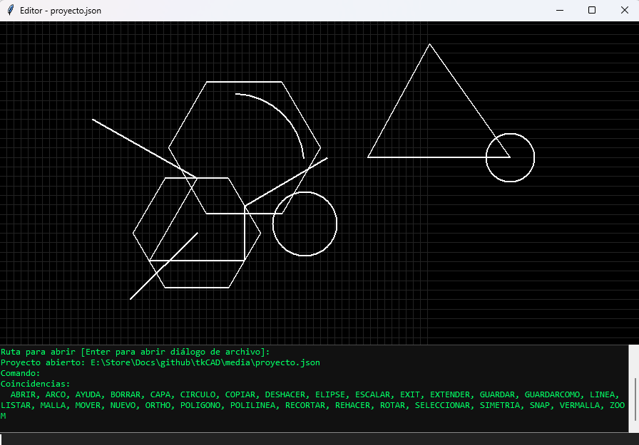

# tkCAD — Editor CAD 2D en Python y Tkinter

tkCAD es un editor de dibujo tipo CAD 2D construido con **Python** y **Tkinter**, con una ventana de comandos estilo CAD, entrada de puntos por teclado y ratón, snaps, selección por ventana, grips de edición y proyectos guardables en JSON.



---

## ✨ Características

- 🖱️ **Interfaz** con consola de comandos, canvas y grips interactivos
- 📐 **Dibujo**: línea, polilínea, círculo, arco, polígono, elipse
- 🛠️ **Edición**: mover, copiar, borrar, rotar, escalar, simetría, recortar, extender
- 🎯 **Snaps**: punto, extremo, punto medio, intersección, ortogonal, cuadrícula
- 📁 **Archivos**: guardar/cargar proyectos en JSON
- 🧠 **Autocompletado** con `Tab` y **historial** con flechas
- 🎨 **Vista previa progresiva** al dibujar polilíneas

## 📦 Instalación

### Requisitos

- [Pixi](https://pixi.sh/) instalado
- Windows 64-bit (otras plataformas con ajustes en `pixi.toml`)

### Pasos

```bash
# Clonar el repositorio

git clone https://github.com/TU_USUARIO/tkCAD.git
cd tkCAD

# Instalar el entorno (crea .pixi/ con todas las dependencias)

pixi install
```

---------

## 🚀 Uso

## Ejecutar la aplicación

```bash
pixi run app
```

Esto lanza la app con `python -m tkcad`. El paquete se instala en modo editable, así que cualquier cambio en `src/tkcad/` se refleja al instante sin reinstalar.

### Entrar al entorno interactivo

```bash
pixi shell
python -m tkcad
```

### Ejecutar los tests

```bash
pixi run test
```

---

## ⌨️ Ventana de comandos

Situada en la parte inferior de la aplicación:

- **Zona de salida**: muestra prompts, mensajes y resultados.
- **Campo de entrada**: donde se escriben comandos y datos.

Teclas especiales:

| Tecla     | Acción                            |
| --------- | --------------------------------- |
| `Enter`   | Enviar entrada / terminar comando |
| `Tab`     | Autocompletar comandos y opciones |
| `↑` / `↓` | Historial de entradas             |
| `Esc`     | Cancelar comando activo           |

---

## 🧰 Comandos disponibles

| Comando       | Alias                   | Descripción                                                                    |
| ------------- | ----------------------- | ------------------------------------------------------------------------------ |
| `LINEA`       | `L`, `LINE`             | Dibuja segmentos encadenados.                                                  |
| `POLILINEA`   | `PL`, `POLYLINE`        | Polilínea; `C` cierra, `Enter` termina.                                        |
| `CIRCULO`     | `C`, `CIRCLE`           | Centro + radio (número, `D` diámetro, punto o clic).                           |
| `ARCO`        | `A`, `ARC`              | Centro, punto inicial y punto final o ángulo incluido (`A`).                   |
| `POLIGONO`    | `POL`, `PG`             | Polígono regular: lados, centro y radio (o `@dist<ángulo` para rotación).      |
| `ELIPSE`      | `EL`, `ELLIPSE`         | Centro, extremo del primer eje y extremo del segundo eje.                      |
| `MOVER`       | `M`, `MOVE`, `MV`       | Mueve la selección (o un tipo) con punto base y destino.                       |
| `COPIAR`      | `CP`, `COPY`            | Copia la selección (o un tipo) con desplazamiento.                             |
| `BORRAR`      | `DEL`, `ERASE`, `D`     | Borra selección o tipo, con confirmación `[S/N]`.                              |
| `ROTAR`       | `R`, `ROTATE`, `RO`     | Rota la selección alrededor de un punto base.                                  |
| `ESCALAR`     | `ES`, `SCALE`, `SC`     | Escala la selección con factor positivo desde un punto base.                   |
| `SIMETRIA`    | `SIM`, `MIRROR`, `MI`   | Refleja la selección respecto a un eje de dos puntos.                          |
| `RECORTAR`    | `TR`, `TRIM`, `RT`      | Recorta una `LINEA` usando otra `LINEA` como límite (IDs + punto a conservar). |
| `EXTENDER`    | `EX`, `EXTEND`          | Extiende una `LINEA` hasta una `LINEA` límite (IDs).                           |
| `SELECCIONAR` | `SEL`, `S`              | `TODO`, `NADA`, `ULTIMO`, `VENTANA`, tipo o IDs (`1,2,3`).                     |
| `LISTAR`      | `LIST`, `ENTIDADES`     | Lista entidades con ID y marca de selección (`*`).                             |
| `AYUDA`       | `HELP`, `COMANDOS`, `?` | Muestra los comandos disponibles con alias.                                    |
| `EXIT`        | `SALIR`, `QUIT`, `X`    | Sale de la aplicación (global, funciona dentro de comandos).                   |
| `GUARDAR`     | `SAVE`, `G`             | Guarda el proyecto (archivo actual, ruta o diálogo).                           |
| `GUARDARCOMO` | `SAVEAS`, `GCOMO`       | Guarda en un archivo nuevo (diálogo o ruta).                                   |
| `ABRIR`       | `OPEN`, `O`, `ABR`      | Abre un proyecto JSON (con confirmación si hay entidades).                     |
| `NUEVO`       | `NEW`, `N`              | Crea un proyecto nuevo (con confirmación si hay entidades).                    |
| `SNAP`        | `SN`, `SNA`             | Activa/desactiva modos de snap y cambia el tamaño de malla (número).           |
| `MALLA`       | `GRID`                  | Activa/desactiva malla y snap a malla.                                         |
| `VERMALLA`    | `VERGRID`               | Muestra/oculta la malla en pantalla.                                           |
| `CAPA`        | `CAPAS`, `LA`           | Gestor de capas: crear, cambiar, ON/OFF, color, bloqueo                        |
| `ZOOM`        | `ZOOM`, `Z`             | Gestor de zoom: + , -, Todo, T/EXT, 2 (o 0.5, etc..)                           |
| `ORTHO`       | `ORT`, `F8`             | Activa/desactiva el forzado ortogonal                                          |

---

## 📐 Entrada de coordenadas

Convención: **`,` separa X e Y** y **`.` es el separador decimal**.

| Formato               | Ejemplo     | Significado                                      |
| --------------------- | ----------- | ------------------------------------------------ |
| Absoluto              | `10,20`     | Punto (10, 20).                                  |
| Absoluto decimal      | `10.5,20.2` | Punto con decimales.                             |
| Separador alternativo | `10.5;20.2` | Equivalente (útil en algunos estados numéricos). |
| Relativo cartesiano   | `@5,3`      | Último punto + (5, 3).                           |
| Relativo polar        | `@100<45`   | Distancia 100, ángulo 45° desde el último punto. |
| Polar absoluto        | `100<30`    | Punto a distancia 100 y ángulo 30° del origen.   |

Los ángulos se miden en **grados**, con `0°` en el eje +X y sentido antihorario.

---

## 🖱️ Uso del ratón

| Acción                                    | Resultado                                              |
| ----------------------------------------- | ------------------------------------------------------ |
| Clic izquierdo sobre entidad              | Selecciona / deselecciona.                             |
| Arrastre izquierda → derecha              | **Ventana**: selecciona lo completamente contenido.    |
| Arrastre derecha → izquierda              | **Cruce**: selecciona lo que toca/cruza el rectángulo. |
| `Shift` + arrastre                        | Añade a la selección actual.                           |
| `Ctrl` + arrastre                         | Quita de la selección actual.                          |
| Clic izquierdo con comando pidiendo punto | Introduce el punto (con snap aplicado).                |
| Clic derecho                              | Equivale a `Enter` (terminar/cancelar).                |
| Arrastrar un grip azul                    | Edita la entidad (vértices, radios, ejes, extremos).   |

---

## 🟦 Grips (pinzamientos)

Al seleccionar entidades aparecen grips azules editables:

| Entidad              | Grips                                |
| -------------------- | ------------------------------------ |
| Línea                | Inicio y fin.                        |
| Polilínea / Polígono | Cada vértice.                        |
| Círculo              | Centro y radio.                      |
| Arco                 | Centro, punto inicial y punto final. |
| Elipse               | Centro, eje X y eje Y.               |

---

## 🧲 Snaps

Se configuran con el comando `SNAP` (o `MALLA` / `VERMALLA` para la rejilla):

| Modo           | Ajusta a                                               |
| -------------- | ------------------------------------------------------ |
| `GRID`         | Malla (rejilla visible + ajuste).                      |
| `PUNTO`        | Vértices y centros.                                    |
| `EXTREMO`      | Extremos de líneas, polilíneas, polígonos y arcos.     |
| `MEDIO`        | Puntos medios de segmentos y arcos.                    |
| `INTERSECCION` | Intersecciones entre segmentos lineales.               |
| `ORTO`         | Movimiento horizontal/vertical respecto al punto base. |

Prioridad: **snaps de objeto → ORTO → GRID**.

Dentro de `SNAP`, escribir un **número** cambia el tamaño de la malla.

## Snaps visuales

## Resultado visual

| Snap          | Símbolo     | Color       |
| ------------- | ----------- | ----------- |
| ENDPOINT      | □           | cian        |
| MIDPOINT      | △           | verde       |
| CENTER        | ○           | magenta     |
| QUADRANT      | ◇           | amarillo    |
| INTERSECTION  | ✕           | naranja     |
| TANGENT       | ○ con línea | magenta     |
| PERPENDICULAR | ⌐           | cian        |
| NEAREST       | \|          | verde claro |


---

## 💾 Proyectos (JSON)

Los proyectos se guardan en JSON con este formato:

```json
  "version": 2,
  "next_entity_id": 1,
  "current_layer": "0",
  "layers": [
    {
      "name": "0",
      "color": "white",
      "visible": true,
      "locked": false
    }
  ],
  "entities": [
    {
      "id": 1,
      "kind": "line",
      "layer": "0",
      "data": {
        "start": {
          "__type__": "Point",
          "x": 50.0,
          "y": 50.0
        },
        "end": {
          "__type__": "Point",
          "x": 120.71067811865476,
          "y": 120.71067811865476
        }
      }
    }
  ]
}
```

- `GUARDAR`: guarda sobre el archivo actual o abre diálogo/ruta.
- `GUARDARCOMO`: fuerza diálogo o ruta nueva.
- `ABRIR`: carga un proyecto (reemplaza el actual, con confirmación).
- `NUEVO`: proyecto vacío (con confirmación).
- El título de la ventana muestra el archivo actual.

---

## 🧱 Modelo de entidades

Todas las figuras se guardan como objetos `Entity`:

```python
Entity(id, kind, data, selected)
```

Tipos (`kind`):

```textile
line, polyline, circle, arc, polygon, ellipse
```

Esto permite que **todos** los comandos (mover, copiar, rotar, escalar, simetría, borrar, selección, grips, guardar/abrir) funcionen de forma uniforme sobre cualquier entidad.

---

## 🏗️ Arquitectura

```bash
tkCAD/
├── pixi.toml                    # Configuración del entorno y tareas
├── pixi.lock                    # Lock de dependencias de Pixi
├── pyproject.toml               # Paquete Python (editable install)
├── README.md                    # Documentación del proyecto
├── .gitattributes               # Atributos Git
├── .gitignore                   # Ignorar archivos
│
├── docs/                        # Documentación adicional
│   └── screenshot.png           # Captura de pantalla de la app
│
├── src/
│   └── tkcad/
│       ├── __main__.py          # Entry point: python -m tkcad
│       ├── app.py               # CadApp: orquestador principal
│       │
│       ├── core/                # Núcleo del CAD (lógica sin UI)
│       │   ├── __init__.py
│       │   ├── command.py       # Command, CommandResult
│       │   ├── entity.py        # Entity base
│       │   ├── layer.py         # Modelo de capas (Layer)
│       │   ├── manager.py       # CommandLineManager
│       │   ├── model.py         # Document/Model (incluye snapshots Undo/Redo)
│       │   ├── parser.py        # parse_point, parse_number
│       │   ├── point.py         # Point
│       │   ├── project.py       # ProjectIO (JSON v2 con capas)
│       │   ├── snapengine.py    # SnapEngine (adaptado a zoom/pan)
│       │   └── types.py         # Alias de comandos, constantes
│       │
│       ├── geometry/            # Utilidades geométricas
│       │   ├── __init__.py
│       │   ├── geometria        # Funciones geométricas auxiliares
│       │   ├── intersection.py  # Intersecciones línea-línea
│       │   ├── projection.py    # projection_param
│       │   └── utils.py         # EPS, utilidades varias
│       │
│       ├── commands/            # Un archivo por comando
│       │   ├── __init__.py
│       │   ├── registry.py      # Registro central de comandos
│       │   │
│       │   ├── drawing/         # Comandos de dibujo
│       │   │   ├── __init__.py
│       │   │   ├── arco.py
│       │   │   ├── circulo.py
│       │   │   ├── elipse.py
│       │   │   ├── line.py
│       │   │   ├── poligono.py
│       │   │   └── poliline.py
│       │   │
│       │   ├── file/            # Comandos de archivo
│       │   │   ├── __init__.py
│       │   │   ├── abrir.py
│       │   │   ├── guardar.py
│       │   │   └── nuevo.py
│       │   │
│       │   ├── modify/          # Comandos de edición
│       │   │   ├── __init__.py
│       │   │   ├── borrar.py
│       │   │   ├── copiar.py
│       │   │   ├── escalar.py
│       │   │   ├── extender.py
│       │   │   ├── mover.py
│       │   │   ├── recortar.py
│       │   │   ├── rotar.py
│       │   │   └── simetria.py
│       │   │
│       │   ├── system/          # Comandos del sistema
│       │   │   ├── __init__.py
│       │   │   ├── ayuda.py
│       │   │   ├── deshacer.py  # Deshacer/Rehacer (snapshots)
│       │   │   └── exitx.py
│       │   │
│       │   └── view/            # Comandos de vista y configuración
│       │       ├── __init__.py
│       │       ├── capa.py      # Gestor de capas
│       │       ├── ortho.py     # Forzado ortogonal (F8)
│       │       ├── seleccion.py
│       │       ├── snap.py
│       │       └── zoom.py      # Zoom, Pan, malla adaptativa
│       │
│       └── ui/                  # Widgets Tkinter
│           ├── __init__.py
│           ├── canvas.py        # CadCanvas (render, zoom, pan, eventos)
│           ├── console.py       # ConsoleWidget (línea de comandos)
│           └── grips.py         # GripManager
│
└── tests/                       # Suite de pytest
    ├── __init__.py
    ├── test_capa.py
    ├── test_commands.py
    ├── test_geometry.py
    ├── test_history.py          # Tests de Deshacer/Rehacer
    ├── test_layers.py           # Tests del modelo de capas
    ├── test_manager.py
    ├── test_model.py            # Tests del modelo (zoom/pan)
    ├── test_model_editing.py    # Tests de recortar/extender
    ├── test_model_transforms.py # Tests de mover, copiar, escalar, simetría
    ├── test_ortho.py            # Tests del forzado ortogonal
    ├── test_parser.py
    ├── test_project_layers.py   # Tests de ProjectIO con capas
    ├── test_projection.py
    └── test_snapengine.py       # Tests del motor de snaps
```

El núcleo (`core/`, `geometry/`, `commands/`) es **independiente de Tkinter** y completamente testeable con `pixi run test`.

## ➕ Añadir un comando nuevo

Añadir un comando nuevo requiere **dos pasos**:

### 1. Crear el archivo del comando

Crea, por ejemplo, `src/tkcad/commands/drawing/spline.py`:

```python
from ...core import Command, CommandResult, Point, parse_point


class SplineCommand(Command):
    name = "SPLINE"
    aliases = ("SPL",)

    def __init__(self):
        self.points = []

    def start(self, ctx):
        ctx.prompt("Primer punto de la spline:")

    def handle_input(self, ctx, text: str) -> CommandResult:
        text = text.strip()
        if not text:
            return self._finish(ctx)
        try:
            p = parse_point(text, self.points[-1] if self.points else None)
        except ValueError as ex:
            ctx.write(f"Punto no válido: {ex}")
            return CommandResult.RUNNING
        self.points.append(p)
        ctx.prompt("Siguiente punto [Enter=terminar]:")
        return CommandResult.RUNNING

    def _finish(self, ctx) -> CommandResult:
        if len(self.points) >= 2:
            ctx.add_polyline(self.points)  # o un método específico
        return CommandResult.FINISHED

    def expects_point(self) -> bool:
        return True

    def get_point_base(self):
        return self.points[-1] if self.points else None
```

### 2. Registrarlo en `src/tkcad/commands/registry.py`

Añade el import y súmalo a la lista `ALL_COMMANDS`:

```python
from .drawing.spline import SplineCommand

ALL_COMMANDS = [
    # ... comandos existentes ...
    SplineCommand,
]
```

**Listo.** `SPLINE` y su alias `SPL` aparecen automáticamente en el autocompletado y en `AYUDA`.

## 🧪 Testing

La suite de tests protege los módulos del núcleo:

```bash
pixi run test
```

----

**Core del Sistema**

#### `test_parser.py`

**Módulo:** `tkcad.core.parser`

- Parseo de números con coma y punto decimal
- Coordenadas cartesianas absolutas (`10,20` y `10;20`)
- Coordenadas relativas (`@5,-5`)
- Coordenadas polares absolutas y relativas (`10<90`, `@10<45`)
- Validación de entradas malformadas

#### `test_manager.py`

**Módulo:** `tkcad.core.manager` (CommandLineManager)

- Registro de comandos con nombres y alias
- Ciclo de vida completo de comandos (start → input → finish)
- Autocompletado por prefijo
- Cancelación con ESC
- Envío de puntos al comando activo
- Limpieza de preview al terminar
- Comandos instantáneos (terminan en `start()`)

#### `test_history.py`

**Módulo:** `tkcad.core.model` (Document - sistema de snapshots)

- `undo()` revierte acciones
- `redo()` reaplica acciones deshechas
- Acciones sin mutaciones no generan historial
- Nueva acción limpia el stack de redo
- Undo/redo restaura estado de capas
- Pila de undos sucesivos

---

### **Modelo de Datos y Capas**

#### `test_layers.py`

**Módulo:** `tkcad.core.layer` + `tkcad.core.model`

- Capa "0" existe por defecto
- Nuevas entidades van a la capa actual
- Validación de capas duplicadas o vacías
- Protección contra borrar capa "0" o capa actual
- Filtrado de entidades visibles por capa
- Capas bloqueadas no se pueden seleccionar
- Apagar capa deselecciona sus entidades

#### `test_project_layers.py`

**Módulo:** `tkcad.core.project` (ProjectIO)

- Round-trip save/load con capas
- Preservación de propiedades de capa (color, visibilidad)
- Migración automática de versión 1 a versión 2 (con capas)

---

### **Operaciones del Documento**

#### `test_model.py`

**Módulo:** `tkcad.core.model` (Document)

- Asignación de IDs secuenciales a entidades
- Sistema de notificación de cambios
- Selección básica (select_all, clear_selection, toggle_selection)
- Borrado de entidades seleccionadas y por tipo
- Búsqueda de entidades por ID
- Cálculo de bounding box

#### `test_model_transforms.py`

**Módulo:** `tkcad.core.model` (Document - transformaciones)

- `move_selected()` - traslación de entidades
- `copy_selected()` - copia sin tocar original
- `scale_selected()` - escalado desde punto base
- `rotate_selected()` - rotación por ángulo
- `mirror_selected()` - simetría respecto a eje
- Validación de desplazamiento cero

#### `test_model_editing.py`

**Módulo:** `tkcad.core.model` (Document - edición geométrica)

- `trim_line_by_line()` - recortar línea contra línea límite
- `extend_line_to_line()` - extender línea hasta límite
- Validación de intersecciones
- Casos de error (sin intersección, ya cruza)

---

### **Comandos de Dibujo**

#### `test_commands.py`

**Módulos:** `tkcad.commands.drawing.*`

- **LINEA**: creación de segmentos, encadenamiento, punto relativo, opciones L/ángulo
- **POLILINEA**: creación, cierre con "C", validación de puntos mínimos
- **CIRCULO**: preview con centro y radio dinámico

---

### **Geometría y Snaps**

#### `test_geometry.py`

**Módulo:** `tkcad.geometry.intersection` + `tkcad.geometry.projection`

- `line_line_intersection()` - intersección de dos líneas
- Líneas paralelas (sin intersección)
- `projection_param()` - proyección de punto sobre segmento
- Casos degenerados (segmento de longitud cero)

#### `test_snapengine.py`

**Módulo:** `tkcad.core.snapengine` (SnapEngine)

- Snap a GRID (cuadrícula)
- Snap a ENDPOINT (extremos)
- Snap a MIDPOINT (puntos medios)
- Snap a INTERSECTION (intersecciones)
- Snap ORTHO (horizontal/vertical desde base)
- Prioridad de snaps (ENDPOINT > GRID)
- Toggle y configuración de modos
- **Tolerancia adaptativa al zoom** (clave para zoom/pan)

#### `test_ortho.py`

**Módulos:** `tkcad.commands.view.ortho` + `tkcad.commands.drawing.line`

- Activación/desactivación del modo ORTHO
- Forzado ortogonal en comando LINEA
- Integración con SnapEngine

---

### **Comandos de Configuración**

#### `test_capa.py`

**Módulo:** `tkcad.commands.view.capa` (CapaCommand)

- Crear y cambiar capa actual
- ON/OFF de visibilidad
- Cambio de color de capa
- BLOQ/DESBLOQ (bloqueo)
- Protección contra borrar capa "0" o capa actual

---

## Resumen de Cobertura

| Área                | Tests | Módulos Cubiertos                                   |
| ------------------- | ----- | --------------------------------------------------- |
| **Parser**          | 10    | `core.parser`                                       |
| **Manager**         | 9     | `core.manager`                                      |
| **Historial**       | 6     | `core.model` (undo/redo)                            |
| **Capas**           | 13    | `core.layer`, `core.model`, `core.project`          |
| **Documento**       | 15    | `core.model` (CRUD, selección, transforms, editing) |
| **Comandos Dibujo** | 12    | `commands.drawing.*`                                |
| **Geometría**       | 5     | `geometry.intersection`, `geometry.projection`      |
| **Snaps**           | 9     | `core.snapengine`                                   |
| **ORTHO**           | 2     | `commands.view.ortho`, `commands.drawing.line`      |
| **Configuración**   | 5     | `commands.view.capa`                                |

**Total: ~86 tests** cubriendo toda la arquitectura del núcleo (`core/`, `geometry/`, `commands/`) de forma independiente a Tkinter.

----

## 📜 Licencia

Este proyecto está licenciado bajo la **Licencia MIT** - una licencia de código abierto permisiva que permite el uso, modificación y distribución libre del software.

### Resumen

- Uso comercial
- Modificación
- Distribución
- Uso privado
- Debe incluir el aviso de copyright y licencia

Para más detalles, consulta el archivo [LICENSE](LICENSE) en este repositorio.

**Copyright (c) 2026 Hernani Alemán Ferraz**

----

## Limitaciones Conocidas

### 1. **Geometría y Edición**

| Limitación                                                                  | Evidencia en el código                                                                                                 |
| --------------------------------------------------------------------------- | ---------------------------------------------------------------------------------------------------------------------- |
| `RECORTAR` y `EXTENDER` solo funcionan entre `LINEA` y límite `LINEA`       | `test_model_editing.py` solo prueba `trim_line_by_line()` y `extend_line_to_line()`                                    |
| El snap `INTERSECCION` solo calcula intersecciones entre segmentos lineales | `test_snapengine.py` usa `make_line()` exclusivamente; `test_geometry.py` solo tiene `line_line_intersection()`        |
| `ESCALAR` es uniforme y solo con factor positivo                            | `test_model_transforms.py`: `scale_selected(Point(0,0), 2.0)` sin pruebas de factores negativos o escalado no uniforme |
| Las elipses no participan en recortes ni intersecciones                     | No hay tests de trim/extend/intersection con `kind="ellipse"`                                                          |
| No hay geometría para arcos en intersecciones                               | `intersection.py` solo tiene `line_line_intersection`, no hay `line_arc_intersection` ni `circle_circle_intersection`  |

### 2. **Snaps y Precisión**

| Limitación                                                          | Evidencia                                                                                    |
| ------------------------------------------------------------------- | -------------------------------------------------------------------------------------------- |
| No hay marcadores visuales de snap                                  | No hay tests ni módulos relacionados con render de snap markers                              |
| Solo 5 modos de snap: GRID, ENDPOINT, MIDPOINT, INTERSECTION, ORTHO | `test_snapengine.py` solo prueba estos 5 modos                                               |
| Faltan snaps: CENTER, QUADRANT, TANGENT, PERPENDICULAR, NEAREST     | Ausencia total en tests y en `snapengine.py`                                                 |
| La tolerancia de snap se ajusta al zoom pero no hay feedback visual | `test_snapengine.py`: `test_tolerancia_de_snap_se_ajusta_con_el_zoom()` pero sin UI asociada |

### 3. **Entidades y Dibujo**

| Limitación                                                             | Evidencia                                                    |
| ---------------------------------------------------------------------- | ------------------------------------------------------------ |
| Solo 6 tipos de entidad: line, polyline, circle, arc, polygon, ellipse | `test_model.py` y estructura de `commands/drawing/`          |
| No hay soporte para texto, puntos, splines, hatch ni bloques           | Ausencia en `commands/drawing/` y en los `kind` de entidades |
| ARCO, POLIGONO y ELIPSE no tienen tests específicos de dibujo          | `test_commands.py` solo prueba LINEA, POLILINEA y CIRCULO    |
| No hay edición de vértices individuales de polilíneas/polígonos        | No hay tests de `add_vertex` o `remove_vertex`               |

### 4. **Interfaz y UX**

| Limitación                                            | Evidencia                                                         |
| ----------------------------------------------------- | ----------------------------------------------------------------- |
| No hay barra de herramientas (toolbar)                | Solo `ui/canvas.py`, `ui/console.py`, `ui/grips.py`               |
| No hay panel de propiedades ni panel de capas GUI     | La gestión de capas es solo por consola (`commands/view/capa.py`) |
| No hay barra de estado con coordenadas en tiempo real | Ausencia de `statusbar.py` en `ui/`                               |
| Selección solo por ventana rectangular                | No hay tests de selección por polígono, fence o cíclica           |

### 5. **Archivos y Persistencia**

| Limitación                                         | Evidencia                                                      |
| -------------------------------------------------- | -------------------------------------------------------------- |
| Solo formato JSON propio                           | `core/project.py` solo tiene `ProjectIO` con JSON              |
| No hay exportación/importación DXF, SVG ni PNG     | Ausencia de comandos `EXPORTAR`/`IMPORTAR` en `commands/file/` |
| No hay control de cambios sin guardar (`modified`) | No hay tests de flag de modificación ni confirmación al salir  |
| No hay autoguardado                                | Ausencia total en tests y código                               |

### 6. **Historial y Estado**

| Limitación                                                              | Evidencia                                                 |
| ----------------------------------------------------------------------- | --------------------------------------------------------- |
| El sistema de snapshots es completo pero no tiene límite de profundidad | `test_history.py` no prueba límites de memoria            |
| No hay agrupación de acciones complejas en un solo paso de undo         | No hay tests de `begin_transaction()`/`end_transaction()` |

---

## Próximas Mejoras Sugeridas

### **Prioridad Alta** (impacto directo en usabilidad)

#### 1. Marcadores visuales de snap (Osnap visual)

- Dibujar símbolos temporales (cuadrado, círculo, triángulo, X) cuando el cursor detecta un snap
- Tooltip con el tipo de snap detectado
- **Módulos a modificar:** `ui/canvas.py`, `core/snapengine.py`

#### 2. Zoom y Pan avanzados

- Zoom por ventana (seleccionar área con rectángulo)
- Zoom extensión automático al abrir archivo
- Zoom previo / siguiente (historial de vistas)
- **Módulos a modificar:** `commands/view/zoom.py`, `core/model.py`

#### 3. Geometría avanzada para snaps y edición

- Intersecciones: línea-círculo, círculo-círculo, línea-arco, arco-arco
- Recortar/extender con círculos y arcos como límites
- **Módulos a modificar:** `geometry/intersection.py`, `core/model.py`, `commands/modify/recortar.py`, `commands/modify/extender.py`

#### 4. Snaps adicionales

- CENTER (centro de círculo/arco/elipse)
- QUADRANT (cuadrantes de círculo/elipse)
- TANGENT (tangente a círculo/arco)
- PERPENDICULAR (perpendicular a línea)
- NEAREST (punto más cercano sobre entidad)
- **Módulos a modificar:** `core/snapengine.py`, `geometry/`

---

### **Prioridad Media** (funcionalidad CAD estándar)

#### 5. Exportación DXF

- Usar librería `ezdxf` para exportar entidades a formato estándar
- Soporte inicial: LINE, LWPOLYLINE, CIRCLE, ARC, ELLIPSE, POLYGON
- **Módulos a crear:** `commands/file/exportar.py`, `core/dxf_export.py`

#### 6. Selección avanzada

- Selección por polígono (window polygon / crossing polygon)
- Selección cíclica (cycle through overlapping entities)
- Selección por fence (línea de corte)
- **Módulos a modificar:** `commands/view/seleccion.py`, `ui/canvas.py`

#### 7. Edición de vértices con grips

- Añadir vértice a polilínea/polígono
- Eliminar vértice
- Convertir segmento a arco (y viceversa)
- **Módulos a modificar:** `ui/grips.py`, `core/model.py`

#### 8. Control de cambios y autoguardado

- Flag `modified` en `Document`
- Confirmación al salir con cambios sin guardar
- Autoguardado cada N minutos o cada M acciones
- **Módulos a modificar:** `core/model.py`, `app.py`

---

### **Prioridad Baja** (mejoras de experiencia)

#### 9. Interfaz gráfica mejorada

- Toolbar con iconos de comandos frecuentes
- Panel de capas GUI (visibilidad, color, bloqueo)
- Panel de propiedades de entidad seleccionada
- Barra de estado con coordenadas X,Y y modo snap activo
- **Módulos a crear:** `ui/toolbar.py`, `ui/layer_panel.py`, `ui/properties.py`, `ui/statusbar.py`

#### 10. Nuevas entidades

- Texto (simple y multilinea)
- Punto (con estilos de punto)
- Spline (curva Bézier o NURBS)
- Hatch (sombreado de áreas cerradas)
- Bloques e inserción (reutilización de geometría)
- **Módulos a crear:** `commands/drawing/texto.py`, `commands/drawing/punto.py`, `commands/drawing/spline.py`, etc.

#### 11. Cotas y medidas

- Cotas lineales, alineadas, angulares, radiales, diametrales
- Estilo de cota configurable
- **Módulos a crear:** `commands/dimension/`, `core/dimension.py`

#### 12. Exportación de imagen

- Exportar vista actual a PNG/SVG
- Configurar resolución y fondo
- **Módulos a crear:** `commands/file/exportar_imagen.py`

---

*Proyecto en desarrollo — tkCAD.*
